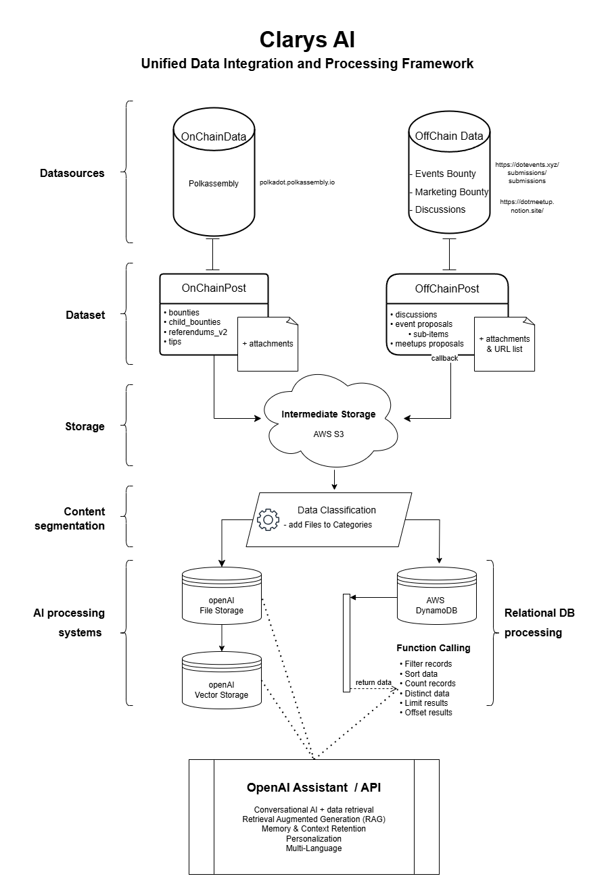

# Clarys AI
Clarys AI is an AI-powered chatbot, built on OpenAI assistant technology. It is accessible via [clarys.ai](https://clarys.ai) and enables the analysis of on-chain and off-chain data through natural language processing (NLP).

## High Level Architecture
Clarys has two main components: the backend part, build on top of Node.JS and the frontend part, built on top of Next.JS.

The **backend** is responsible for automating data collection and processing tasks, efficiently managing data flow to support the chat-based experience. It sets up cron jobs to regularly fetch on-chain and off-chain data, ensuring that information is kept up to date. This data is then stored in AWS S3 and also pushed to OpenAI vector storage, where it can be leveraged for retrieval-augmented generation (RAG) and other AI-driven processes. Additionally, the backend exposes APIs to facilitate seamless access to the processed data (stored in AWS DynamoDB), allowing for smooth integration with front-end components and other system modules. This setup ensures a reliable, real-time data pipeline to support interactive user experiences. The backend APIs are exposed through Swagger [here](http://ec2-34-207-233-187.compute-1.amazonaws.com:3000/swagger/).
- Deployment Platform: AWS EC2 Instance – type: worker /Docker Virtualization
- Tech Stack:
  - Node.js
  - Swagger
  - Express
- Storage:
  - Deployment Platform: AWS
  - Storage Service: S3 Bucket for raw files, DynamoDB for data
  - Storage Model Types: JSON Objects

The **[frontend](https://github.com/mcanti/clarys.ai)** is built on top of [Next.js AI Chatbot template by Vercel](https://vercel.com/templates/next.js/nextjs-ai-chatbot). 
The application leverages the following technologies:
- Next.js App Router
  - Advanced routing for seamless navigation and performance
  - React Server Components (RSCs) and Server Actions for server-side rendering and increased performance
- AI SDK
  - Unified API for generating text, structured objects, and tool calls with LLMs
  - Hooks for building dynamic chat and generative user interfaces
  - Supports OpenAI (default), Anthropic, Cohere, and other model providers
  - Supports OpenAI Assistants API
- shadcn/ui
  - Styling with Tailwind CSS
  - Component primitives from Radix UI for accessibility and flexibility
- Data Persistence
  - Vercel Postgres powered by Neon for saving chat history and user data
  - Vercel Blob for efficient file storage (currently not used)
- NextAuth.js
  - Simple and secure authentication




## Leveraging OpenAI API
o	[Files API](https://platform.openai.com/docs/api-reference/files): Files are used to upload documents that can be used with features like Assistants, Fine-tuning, and Batch API. Files in the OpenAI API are used to extend the assistant’s capabilities by providing it with custom datasets or documents that it can reference to enhance responses, perform fine-tuning, or handle large inputs. By uploading structured or unstructured data, we’re able to customize the assistant’s behavior, improve search and retrieval tasks, and generate more relevant, data-driven results. This feature is particularly valuable for integrating AI into workflows that involve specialized knowledge, such as the Polkadot ecosystem, or for managing large volumes of text data, like OpenGov's on-chain and off-chain proposals. 
o	[Assistants API](https://platform.openai.com/docs/api-reference/assistants): OpenAI’s assistants API provide advanced AI-driven solutions for a wide range of tasks, including personal assistance, and more. Clarys AI leverages the assistant API to achieve two things: `function calling`, allowing the assistant to request additional data from our backend, and `RAG` (retrieval augmented generation), by searching the vector store for relevant content for each query.
o	[Vector Stores API](https://platform.openai.com/docs/api-reference/vector-stores): integrating a vector store with OpenAI’s assistant allows for more intelligent, dynamic, and contextually aware interactions by enabling the assistant to search for and retrieve semantically similar information quickly and efficiently. This enhances the assistant’s ability to answer questions, recommend content, and personalize experiences based on past interactions or external data sources. Vector stores are particularly useful for managing large datasets, improving search accuracy, and supporting advanced use cases like knowledge management for OpenGov data.

## Storage
The on- and off-chain data is retrieved daily and stored on the AWS S3 in 4 folders (OnChainPosts, OffChainPosts, OnChainPost, OffChainPost):


Each folder contains folders for each proposal type. A list of proposals of that type, folders for each proposal containing the proposal data as a json file and the documents folder with the attached files. After storing them in S3, data is fed to the OpenAI file storage and then from OpenAI file storage we load them into the vector storage to provide data access to the assistant.

### Storage Structure for On-chain Data
```
OnChainPosts/
    bounties/bounties-List.json
    child_bounties/child_ bounties-List.json
    referendums_v2/ referendums _v2-List.json
    tips/tips-List.json
OnChainPost/
    bounties/{bountyId}/#{bountyId}.json
                                               /docs/{docId}.docx
    child_bounties/{child_bountyId}/#{child_bountyId}.json
                                                                       /docs/{docId}.docx
    referendums_v2/{referendums_v2Id}/#{referendums_v2Id}.json
                                                                                 /docs/{docId}.docx
    tips/{tipId}/#{tipId}.json
                          /docs/{docId}.docx
```
### Storage Structure for Off-chain Data
```
OffChainPosts/
    discussions/discussions-List.json
    events/events-List.json
                     /subEvents-List.json
    meetups/meetups-List.json
OffChainPost/
    discussions/{discussionId}/#{discussionId}.json
                             		/docs/{docId}.docx
    events/{eventId}/#{eventId}.json
                                  /docs/{docId}.docx
    subevents/{subeventId}/#{subeventId}.json
                                   /docs/{docId}.docx
    meetups/{meetupsId}/#{meetupsId}.json
                                                  /docs/{docId}.docx
```

## Deployment

The frontend is hosted on vercel.com and leverages the automatic continuous deployment features of Vercel.

The backend is currently hosted on AWS EC2. THe backend can be containerized for easy setup and deployment. You can use either Docker or Podman to build and run the container, as both tools are compatible with this setup.

### Prerequisites

Ensure you have either Docker or Podman installed on your system.

[Docker Installation Guide](https://docs.docker.com/engine/install/)
[Podman Installation Guide](https://podman.io/docs/installation)

### Building the Docker Image

1. **Clone the Repository:**

```bash
git clone https://github.com/your-username/your-repository.git
cd your-repository

```

2. **Build the Image:**

**Using Docker**

```bash
docker build -t your-image-name .
```

**Using Podman**

```bash
podman build -t your-image-name .
```

This will create an image named your-image-name based on the configuration in the Dockerfile.

## Running the Container

To run the container, you’ll need to map any required ports and pass environment variables.

1. **Run the Container:**

**Using Docker**

```bash
docker run --env-file .env -p 3000:3000 your-image-name
```

**Using Podman**

```bash
podman run --env-file .env -p 3000:3000 your-image-name
```

* --env-file: Specifies environment variables, typically stored in a .env file.
* -p 3000:3000: Maps port 3000 of your local machine to port 3000 in the container.

### Stopping the Container

To stop the running container:

**Using Docker**

```bash
docker stop container_id_or_name

```

**Using Podman**

```bash
podman stop container_id_or_name
```

Use docker ps or podman ps to list running containers and get the container ID or name.

### Saving the Image for Distribution

If you want to export the image to a .tar file for sharing:

**Using Docker**

```bash
docker save -o your-image-name.tar your-image-name
```

**Using Podman**

```bash
podman save -o your-image-name.tar your-image-name
```

This .tar file can then be loaded on another system.

### Loading the Image

To load the saved image on a new system:

**Using Docker**

```bash
docker load -i your-image-name.tar
```

**Using Podman**

```bash
podman load -i your-image-name.tar
```

## Environment Configuration

Ensure all required environment variables are properly configured in your `.env` file before starting the application.

## Google Storage Service

Ensure to create and set up the Project and Cloud Storage Service Account for accessing Google Strorage from https://console.cloud.google.com/storage and import the settings in your `.polkadot-440407-afc15f4b2e56.json` file before starting the application.

